<h1 align="center">
  <br>
  Towards Multimodal Skills for General Visual Agents
</h1>

<div align="center">

[](https://www.python.org/downloads/)
[](LICENSE)
[](https://github.com/xlang-ai/OSWorld)
[](https://zkangning.github.io/towards_mmskills/)
[](https://zkangning.github.io/towards_mmskills/skills.html)
[](https://zkangning.github.io/towards_mmskills/cases.html)
[](https://github.com/zkangning/towards_mmskills/stargazers)

</div>

<p align="center">
  <a href="#-latest-news">News</a> |
  <a href="https://zkangning.github.io/towards_mmskills/">Website</a> |
  <a href="https://zkangning.github.io/towards_mmskills/skills.html">Skill Library</a> |
  <a href="https://zkangning.github.io/towards_mmskills/cases.html">Case Studies</a> |
  <a href="#-overview">Overview</a> |
  <a href="#-installation">Installation</a> |
  <a href="#-quick-start">Quick Start</a> |
  <a href="#-citation">Citation</a>
</p>

<h5 align="center">If you find this project helpful, please give us a star ⭐ for the latest updates.</h5>

<div align="center">
  
</div>

## 📣 Latest News

- **[May 2026]** The website now includes [case-study video comparisons](https://zkangning.github.io/towards_mmskills/cases.html) for no-skill, text-only, and multimodal MMSkills runs.
- **[May 2026]** The project website and searchable [MMSkills Library](https://zkangning.github.io/towards_mmskills/skills.html) are live, indexing **247 Ubuntu GUI skills** from the open-source skill assets.
- **[May 2026]** Public MMSkills release is available with a compact multimodal desktop-skill subset, runtime agent adapters, and OSWorld integration files.
- **[May 2026]** The released package includes Ubuntu skills across Chrome, GIMP, LibreOffice, OS, Thunderbird, VLC, VS Code, and multi-app workflows.
- **[May 2026]** The branch-loaded MMSkill runtime can run in text-only or multimodal skill modes with model-agnostic OpenAI-compatible and native Gemini-compatible endpoints.

## 🎬 Case Studies

Five OSWorld cases compare the same task under no skills, text-only skill guidance, and multimodal MMSkills. Click a thumbnail to open the corresponding clip, or browse the full layout at [zkangning.github.io/towards_mmskills/cases.html](https://zkangning.github.io/towards_mmskills/cases.html).

| Case | No skills | Text-only | MMSkills |
|------|-----------|-----------|----------|
| Calc merged headers | <a href="https://zkangning.github.io/towards_mmskills/assets/case-studies/case_01_calc_merged_headers_qwen3/no_skills.mp4">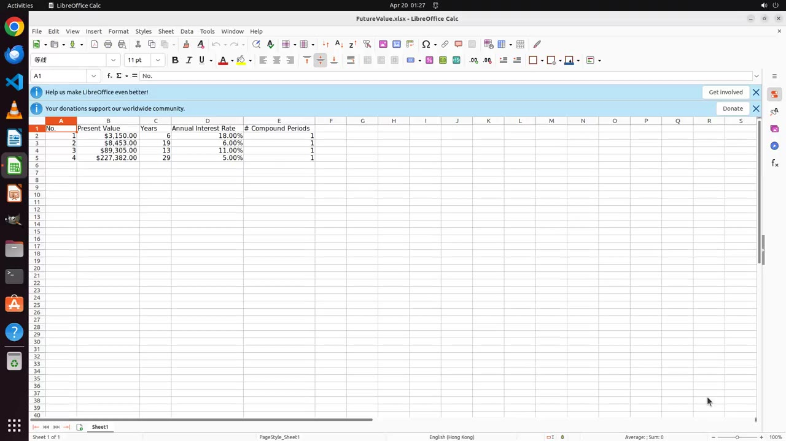</a> | <a href="https://zkangning.github.io/towards_mmskills/assets/case-studies/case_01_calc_merged_headers_qwen3/text_only.mp4">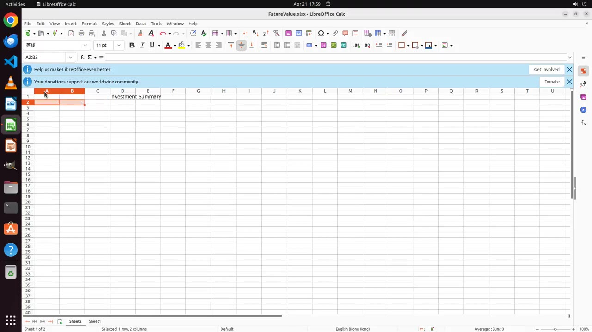</a> | <a href="https://zkangning.github.io/towards_mmskills/assets/case-studies/case_01_calc_merged_headers_qwen3/multimodal.mp4">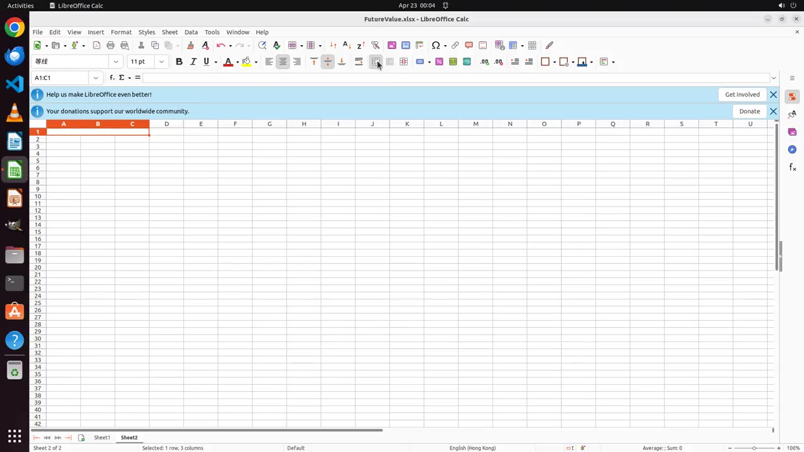</a> |
| VS Code local VSIX install | <a href="https://zkangning.github.io/towards_mmskills/assets/case-studies/case_02_vscode_install_vsix_qwen3/no_skills.mp4">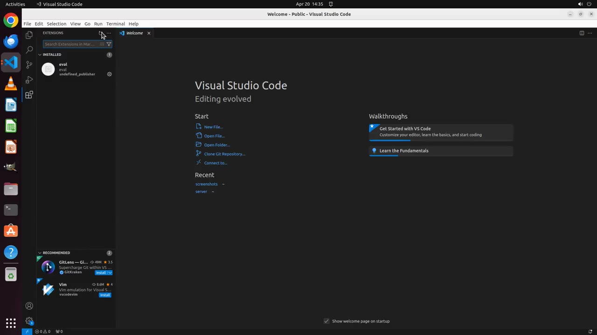</a> | <a href="https://zkangning.github.io/towards_mmskills/assets/case-studies/case_02_vscode_install_vsix_qwen3/text_only.mp4">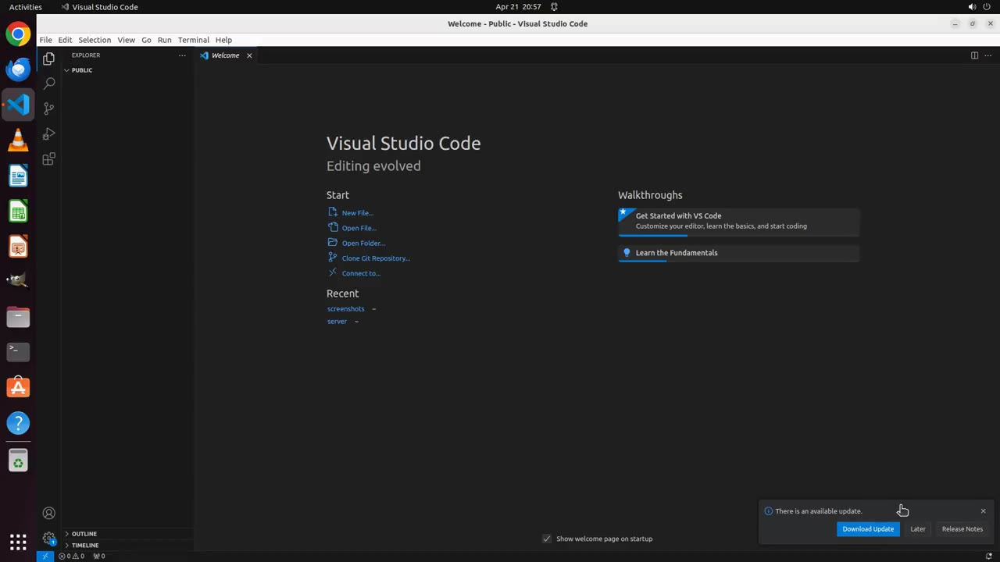</a> | <a href="https://zkangning.github.io/towards_mmskills/assets/case-studies/case_02_vscode_install_vsix_qwen3/multimodal.mp4">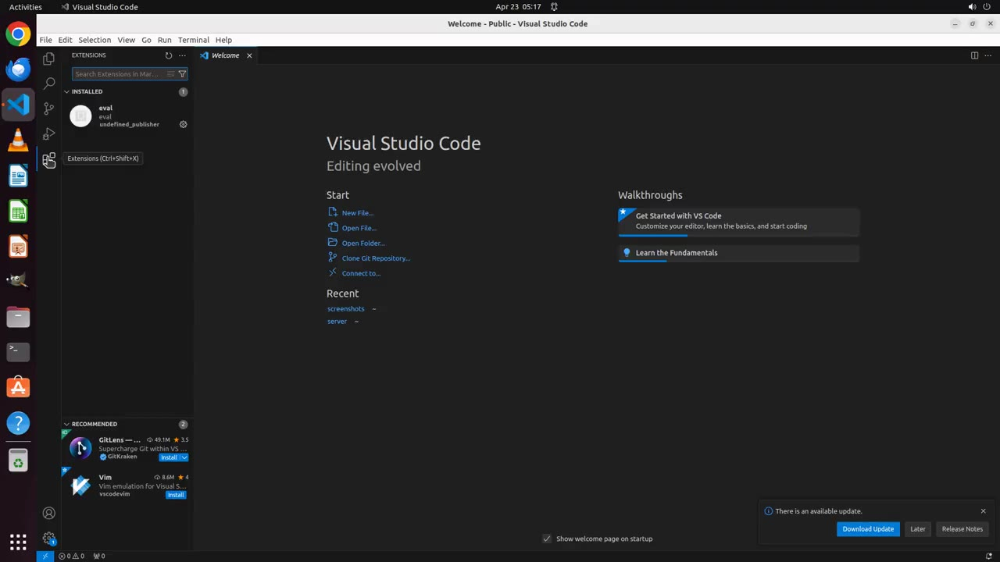</a> |
| GIMP text-layer move | <a href="https://zkangning.github.io/towards_mmskills/assets/case-studies/case_03_gimp_move_text_box_geminipro31/no_skills.mp4">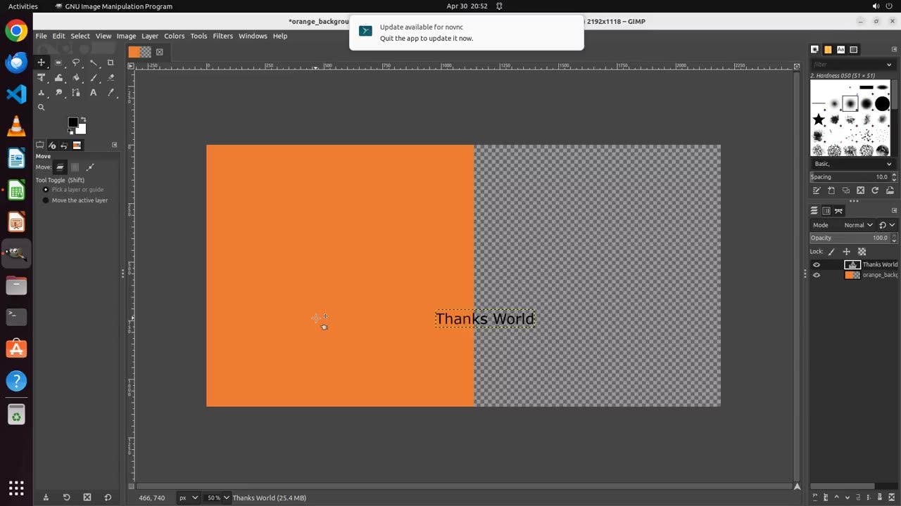</a> | <a href="https://zkangning.github.io/towards_mmskills/assets/case-studies/case_03_gimp_move_text_box_geminipro31/text_only.mp4">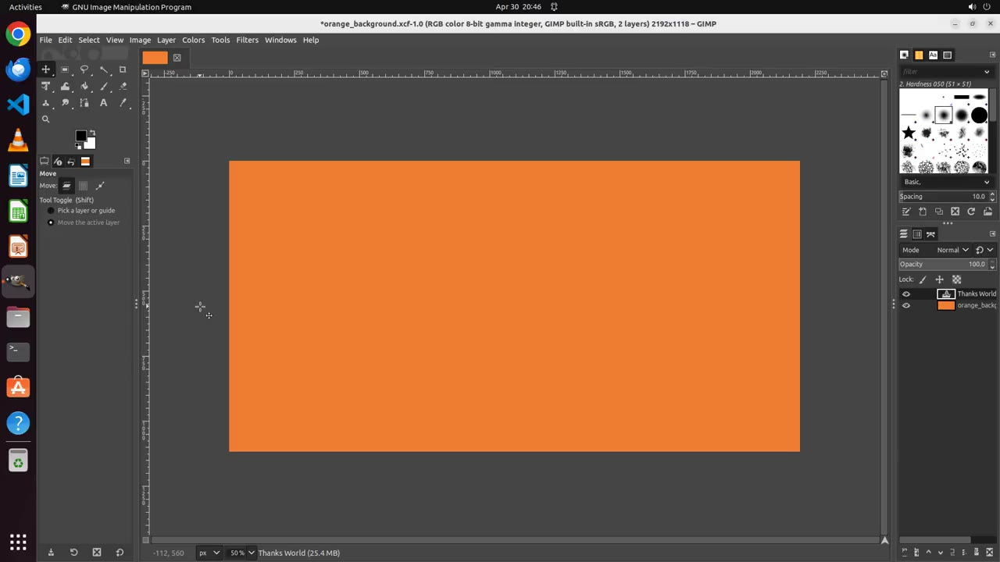</a> | <a href="https://zkangning.github.io/towards_mmskills/assets/case-studies/case_03_gimp_move_text_box_geminipro31/multimodal.mp4">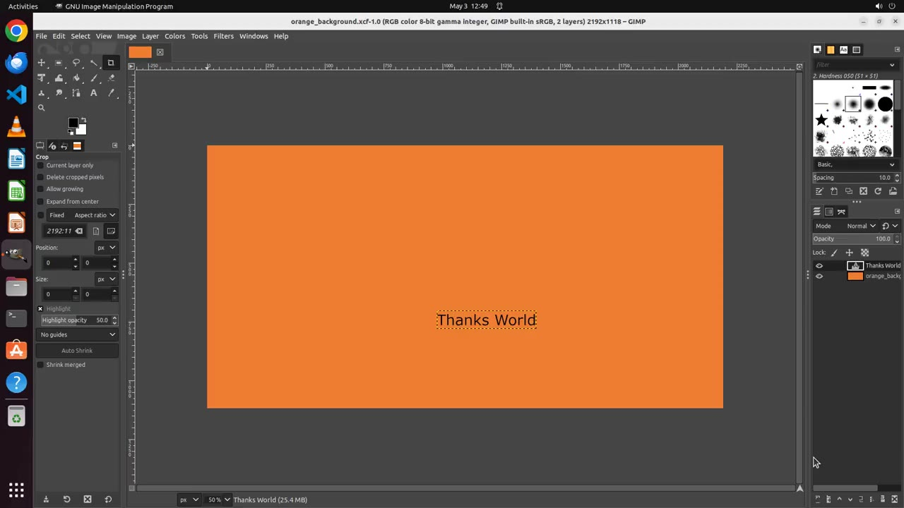</a> |
| Calc chart creation | <a href="https://zkangning.github.io/towards_mmskills/assets/case-studies/case_04_calc_clustered_chart_geminipro31/no_skills.mp4">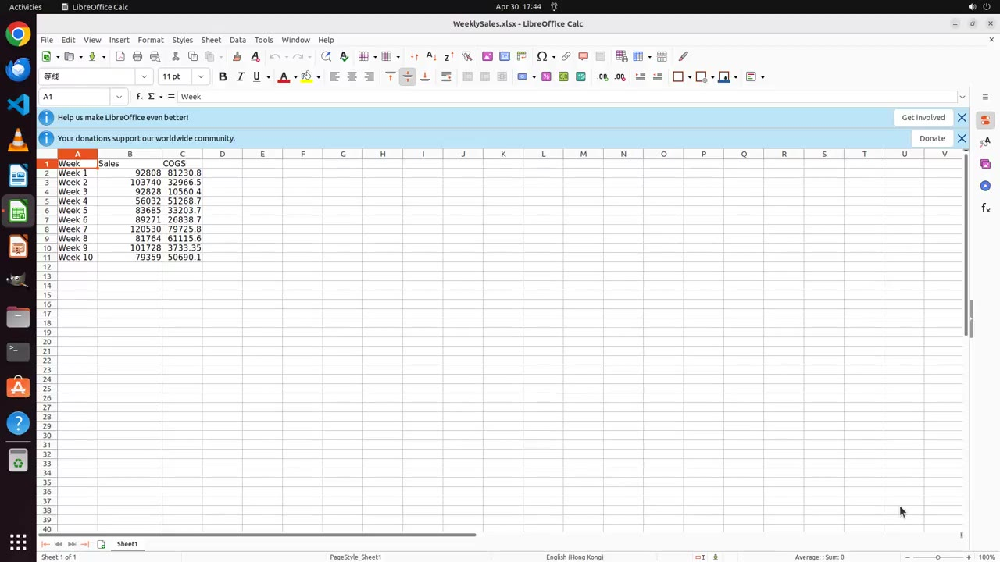</a> | <a href="https://zkangning.github.io/towards_mmskills/assets/case-studies/case_04_calc_clustered_chart_geminipro31/text_only.mp4">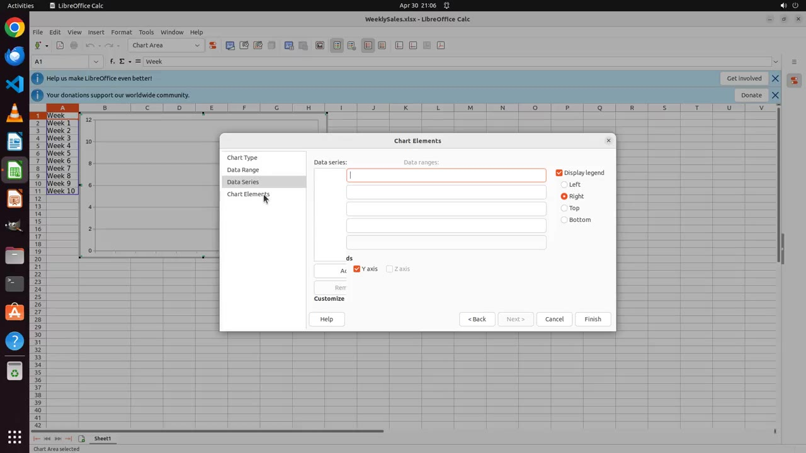</a> | <a href="https://zkangning.github.io/towards_mmskills/assets/case-studies/case_04_calc_clustered_chart_geminipro31/multimodal.mp4">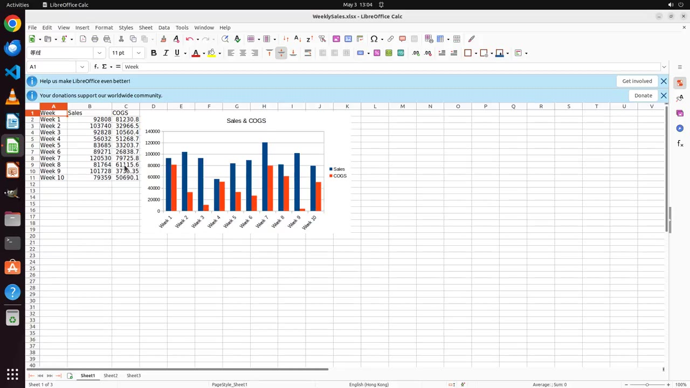</a> |
| Impress note and background | <a href="https://zkangning.github.io/towards_mmskills/assets/case-studies/case_05_impress_purple_note_kimi_k26/no_skills.mp4">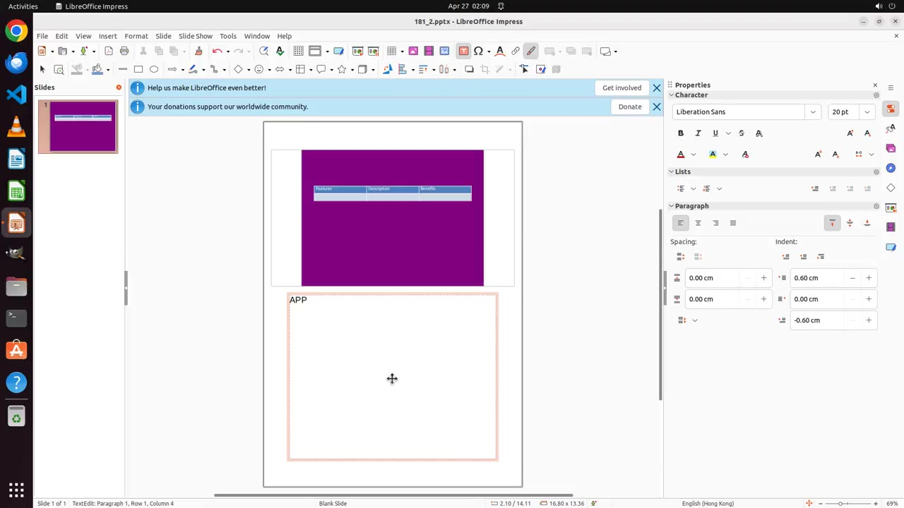</a> | <a href="https://zkangning.github.io/towards_mmskills/assets/case-studies/case_05_impress_purple_note_kimi_k26/text_only.mp4"></a> | <a href="https://zkangning.github.io/towards_mmskills/assets/case-studies/case_05_impress_purple_note_kimi_k26/multimodal.mp4">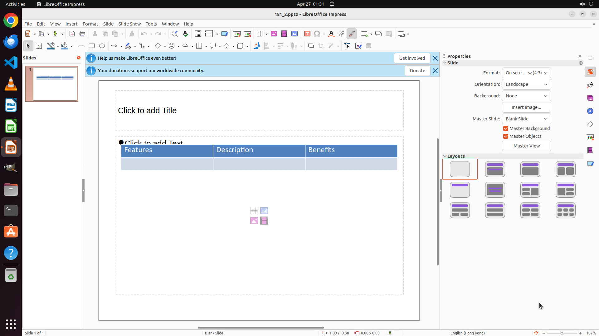</a> |

## 💡 Overview

**MMSkills** is a framework for representing, loading, and using reusable multimodal procedural knowledge for visual agents. Each skill combines textual procedure guidance, compact state-card metadata, and optional visual references. At inference time, the agent keeps only lightweight skill hints in the main context, then opens a temporary skill branch when task state suggests that a skill may help.

<div align="center">
  
</div>

This repository is a focused open-source release. It is not a full OSWorld fork; instead, it provides the MMSkill runtime layer, an install script, OSWorld runner patches, task-to-skill mappings, and a representative public skill library.

Project pages:

- [MMSkills website](https://zkangning.github.io/towards_mmskills/)
- [Searchable Ubuntu Skill Library](https://zkangning.github.io/towards_mmskills/skills.html)
- [Case-study video comparisons](https://zkangning.github.io/towards_mmskills/cases.html)

## ✨ Highlights

<table>
  <tr>
    <td width="50%"><strong>🧩 Self-contained skill packages</strong><br>Each skill directory contains <code>SKILL.md</code>, runtime state cards, audit state cards, and visual keyframes.</td>
    <td width="50%"><strong>👁️ Multimodal evidence gating</strong><br>The runtime first decides whether visual references are needed, then loads only the requested state views.</td>
  </tr>
  <tr>
    <td width="50%"><strong>🧠 Branch-loaded planning</strong><br>A temporary planner branch consults selected skills and returns concise guidance, fallback advice, and verification cues.</td>
    <td width="50%"><strong>🔌 OSWorld ready</strong><br>Helper scripts install the agent files, runner integration, skills, and task mappings into a local OSWorld checkout.</td>
  </tr>
</table>

## 🗂️ Repository Layout

```text
MMSkills/
├── assets/                    # README figures, website assets, and skill-library previews
├── mm_agents/                 # MMSkill runtime architecture and model adapters
├── osworld_integration/       # MMSkills-aware OSWorld runner files
├── skills_library/            # Public multimodal skills subset for direct runtime use
├── task_skill_mappings/       # OSWorld task-to-skill mapping for released skills
└── scripts/
    ├── build_skill_library_site.py # Generate the website skill-library index
    ├── install_into_osworld.py # Install this release into an OSWorld checkout
    └── sync_from_sources.py    # Maintainer sync helper for source checkouts
```

## 🧠 Architecture

The public runtime entrypoint is [`mm_agents/mm_skill_agent.py`](mm_agents/mm_skill_agent.py), exposed in OSWorld as:

```bash
--agent_type mm_skill
```

The architecture is model-agnostic. A main visual agent receives compact skill hints; when a skill may apply, the runtime opens a branch that decides whether visual evidence is needed, requests relevant state views, compares them with the live screenshot, and returns structured guidance for the next grounded action.

The reference integration supports:

- `mm_skill`: multimodal branch-loaded skill consultation.
- `general_text_skill`: text-only skill consultation for ablation and lightweight runs.
- `general`: baseline model-agnostic screenshot-to-pyautogui visual-agent routing.

Legacy `gemini`, `gemini_skill`, and `gemini_text_skill` CLI names are still accepted by the runner as aliases for compatibility, but the public files and recommended commands use the model-agnostic `general*` names.

Any screenshot-capable VLM served through an OpenAI-compatible chat-completions API can use the same `general*` and `mm_skill` interfaces by setting `--model`, `--api_model` when needed, `--base_url`, and `--api_key`.

## 🔧 Installation

### 1. Clone MMSkills

```bash
git clone https://github.com/zkangning/towards_mmskills.git
cd towards_mmskills
```

### 2. Install Python dependencies

```bash
python3 -m venv .venv
source .venv/bin/activate
pip install -r requirements.txt
```

### 3. Install into OSWorld

Clone and install OSWorld following its upstream instructions, then run:

```bash
python3 scripts/install_into_osworld.py /path/to/OSWorld --with-runner --with-skills
```

This copies the MMSkill agent files into `OSWorld/mm_agents/`, installs the MMSkills-aware runner files, and copies the released `skills_library/` plus `task_skill_mappings/`.

### 4. Configure model endpoints

For an OpenAI-compatible endpoint:

```bash
export OPENAI_BASE_URL="https://your-openai-compatible-endpoint/v1"
export OPENAI_API_KEY="your_api_key"
```

For native Gemini-compatible routing, pass `--api_backend gemini` and set:

```bash
export GEMINI_BASE_URL="https://your-gemini-compatible-endpoint/v1"
export GEMINI_API_KEY="your_api_key"
```

## 🏃 Quick Start

Run commands from the OSWorld checkout after installation.

### Baseline Without Skills

```bash
python run.py \
  --agent_type general \
  --model gpt-4o \
  --api_backend openai \
  --observation_type screenshot \
  --action_space pyautogui \
  --max_steps 20 \
  --test_all_meta_path evaluation_examples/test_nogdrive.json \
  --domain chrome \
  --result_dir results/no_skills
```

### Text-Only Skills

```bash
python run.py \
  --agent_type general_text_skill \
  --model gpt-4o \
  --api_backend openai \
  --observation_type screenshot \
  --action_space pyautogui \
  --max_steps 20 \
  --skills_library_dir skills_library \
  --task_skill_mapping_root task_skill_mappings/task_skill_mapping.json \
  --skill_mode text_only \
  --text_skill_mode branch_planner \
  --test_all_meta_path evaluation_examples/test_nogdrive.json \
  --domain chrome \
  --result_dir results/text_only
```

### Multimodal MMSkill Agent

```bash
python run.py \
  --agent_type mm_skill \
  --model gpt-4o \
  --api_backend openai \
  --observation_type screenshot \
  --action_space pyautogui \
  --max_steps 20 \
  --skills_library_dir skills_library \
  --task_skill_mapping_root task_skill_mappings/task_skill_mapping.json \
  --skill_mode multimodal \
  --task_skill_top_k 6 \
  --save_conversation_json \
  --test_all_meta_path evaluation_examples/test_nogdrive.json \
  --domain chrome \
  --result_dir results/mm_skill_multimodal
```

Use `--domain all` for the full no-Google-Drive OSWorld split. The runner writes trajectories, screenshots, `skill_invocations.json`, `skill_usage_summary.json`, and aggregate metrics under the selected `--result_dir`.

## 📚 Skill Library

The website indexes **247 Ubuntu GUI skills** from the open-source skill assets. Each skill card links to a structured view of its `SKILL.md`, runtime state cards, and ordered visual references.

Browse the live library at [zkangning.github.io/towards_mmskills/skills.html](https://zkangning.github.io/towards_mmskills/skills.html).

The repository also includes a compact runtime-ready subset under [`skills_library/`](skills_library/) for immediate OSWorld integration.

## 📦 Skill Package Format

```text
skills_library/<domain>/<skill_name>/
├── SKILL.md                  # Procedure, applicability, transfer limits, checks
├── runtime_state_cards.json  # Compact state/view metadata used at inference time
├── state_cards.json          # Audit-grade state metadata for inspection
├── plan.json                 # Generated plan metadata, when available
└── Images/                   # Full frames, focus crops, before/after references
```

The main agent sees only concise skill names and state hints. Detailed visual evidence is loaded lazily by the branch planner, which keeps the main context compact while preserving access to state-specific multimodal references.

`runtime_state_cards.json` is the inference-facing version: it contains compact state descriptions, when-to-use rules, visible cues, verification cues, and selected image views for branch-time loading. `state_cards.json` is the richer authoring/audit version: it keeps transfer-limit notes, highlight targets, grounding queries, bounding boxes, crop decisions, and evidence-source metadata for inspection and regeneration.

## 🧪 Outputs

MMSkills adds skill-aware artifacts to OSWorld result directories:

| File | Purpose |
|------|---------|
| `skill_invocations.json` | Per-branch consultation records, selected states, requested views, and planner outputs |
| `skill_usage_summary.json` | Aggregate skill counts, branch success counts, exhausted skills, and final actions |
| `conversation.json` | Optional main and branch conversation trace when `--save_conversation_json` is enabled |

## 🤝 Contributing

Contributions are welcome for new skills, runtime integrations, documentation, and reproducibility fixes. Please read [`CONTRIBUTING.md`](CONTRIBUTING.md) before opening an issue or pull request.

## 📄 License

This project is released under the [Apache License 2.0](LICENSE). Portions of the OSWorld integration are derived from OSWorld; see [NOTICE](NOTICE) for attribution details.

## 📝 Citation

If you use MMSkills in your research or applications, please cite this repository:

```bibtex
@software{mmskills2026,
  title = {MMSkills: Towards Multimodal Skills for General Visual Agents},
  year = {2026},
  url = {https://github.com/zkangning/towards_mmskills}
}
```

You can also use the machine-readable citation metadata in [`CITATION.cff`](CITATION.cff).
