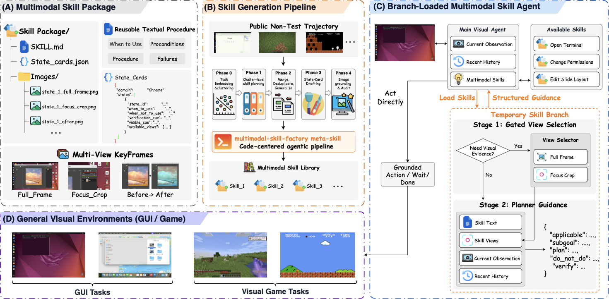

<h1 align="center">
  <br>
  Towards Multimodal Skills for General Visual Agents
</h1>

<div align="center">

[](https://www.python.org/downloads/)
[](LICENSE)
[](https://github.com/xlang-ai/OSWorld)
[](skills_library)
[](https://github.com/zkangning/towards_mmskills/stargazers)

</div>

<p align="center">
  <a href="#-latest-news">News</a> |
  <a href="#-overview">Overview</a> |
  <a href="#-installation">Installation</a> |
  <a href="#-quick-start">Quick Start</a> |
  <a href="#-released-skills">Released Skills</a> |
  <a href="#-citation">Citation</a>
</p>

<h5 align="center">If you find this project helpful, please give us a star ⭐ for the latest updates.</h5>

<div align="center">
  
</div>

## 📣 Latest News

- **[May 2026]** Public MMSkills release is available with a compact multimodal desktop-skill subset, runtime agent adapters, and OSWorld integration files.
- **[May 2026]** The released package includes **16 skills** across Chrome, GIMP, LibreOffice, OS, Thunderbird, VLC, and VS Code.
- **[May 2026]** The branch-loaded MMSkill runtime can run in text-only or multimodal skill modes with OpenAI-compatible and Gemini-compatible endpoints.

## 💡 Overview

**MMSkills** is a framework for representing, loading, and using reusable multimodal procedural knowledge for visual agents. Each skill combines textual procedure guidance, compact state-card metadata, and optional visual references. At inference time, the agent keeps only lightweight skill hints in the main context, then opens a temporary skill branch when task state suggests that a skill may help.

<div align="center">
  
</div>

This repository is a focused open-source release. It is not a full OSWorld fork; instead, it provides the MMSkill runtime layer, an install script, OSWorld runner patches, task-to-skill mappings, and a representative public skill library.

## ✨ Highlights

<table>
  <tr>
    <td width="50%"><strong>🧩 Self-contained skill packages</strong><br>Each skill directory contains <code>SKILL.md</code>, runtime state cards, audit state cards, and visual keyframes.</td>
    <td width="50%"><strong>👁️ Multimodal evidence gating</strong><br>The runtime first decides whether visual references are needed, then loads only the requested state views.</td>
  </tr>
  <tr>
    <td width="50%"><strong>🧠 Branch-loaded planning</strong><br>A temporary planner branch consults selected skills and returns concise guidance, fallback advice, and verification cues.</td>
    <td width="50%"><strong>🔌 OSWorld ready</strong><br>Helper scripts install the agent files, runner integration, skills, and task mappings into a local OSWorld checkout.</td>
  </tr>
</table>

## 🗂️ Repository Layout

```text
MMSkills/
├── assets/                    # README figure and project title asset
├── mm_agents/                 # MMSkill runtime architecture and model adapters
├── osworld_integration/       # MMSkills-aware OSWorld runner files
├── skills_library/            # Public multimodal skills subset
├── task_skill_mappings/       # OSWorld task-to-skill mapping for released skills
└── scripts/
    ├── install_into_osworld.py # Install this release into an OSWorld checkout
    └── sync_from_sources.py    # Maintainer sync helper for source checkouts
```

## 🧠 Architecture

The public runtime entrypoint is [`mm_agents/mm_skill_agent.py`](mm_agents/mm_skill_agent.py), exposed in OSWorld as:

```bash
--agent_type mm_skill
```

The architecture is model-agnostic. A main visual agent receives compact skill hints; when a skill may apply, the runtime opens a branch that decides whether visual evidence is needed, requests relevant state views, compares them with the live screenshot, and returns structured guidance for the next grounded action.

The reference integration supports:

- `mm_skill`: multimodal branch-loaded skill consultation.
- `gemini_text_skill`: text-only skill consultation for ablation and lightweight runs.
- `gemini`: baseline Gemini/OpenAI-compatible visual-agent routing.

## 🔧 Installation

### 1. Clone MMSkills

```bash
git clone https://github.com/zkangning/towards_mmskills.git
cd towards_mmskills
```

### 2. Install Python dependencies

```bash
python3 -m venv .venv
source .venv/bin/activate
pip install -r requirements.txt
```

### 3. Install into OSWorld

Clone and install OSWorld following its upstream instructions, then run:

```bash
python3 scripts/install_into_osworld.py /path/to/OSWorld --with-runner --with-skills
```

This copies the MMSkill agent files into `OSWorld/mm_agents/`, installs the MMSkills-aware runner files, and copies the released `skills_library/` plus `task_skill_mappings/`.

### 4. Configure model endpoints

For an OpenAI-compatible endpoint:

```bash
export OPENAI_BASE_URL="https://your-openai-compatible-endpoint/v1"
export OPENAI_API_KEY="your_api_key"
```

For native Gemini-compatible routing, pass `--api_backend gemini` and set:

```bash
export GEMINI_BASE_URL="https://your-gemini-compatible-endpoint/v1"
export GEMINI_API_KEY="your_api_key"
```

## 🏃 Quick Start

Run commands from the OSWorld checkout after installation.

### Baseline Without Skills

```bash
python run.py \
  --agent_type gemini \
  --model gemini-3-pro-preview \
  --api_backend openai \
  --observation_type screenshot \
  --action_space pyautogui \
  --max_steps 20 \
  --test_all_meta_path evaluation_examples/test_nogdrive.json \
  --domain chrome \
  --result_dir results/no_skills
```

### Text-Only Skills

```bash
python run.py \
  --agent_type gemini_text_skill \
  --model gemini-3-pro-preview \
  --api_backend openai \
  --observation_type screenshot \
  --action_space pyautogui \
  --max_steps 20 \
  --skills_library_dir skills_library \
  --task_skill_mapping_root task_skill_mappings/task_skill_mapping.json \
  --skill_mode text_only \
  --text_skill_mode branch_planner \
  --test_all_meta_path evaluation_examples/test_nogdrive.json \
  --domain chrome \
  --result_dir results/text_only
```

### Multimodal MMSkill Agent

```bash
python run.py \
  --agent_type mm_skill \
  --model gemini-3-pro-preview \
  --api_backend openai \
  --observation_type screenshot \
  --action_space pyautogui \
  --max_steps 20 \
  --skills_library_dir skills_library \
  --task_skill_mapping_root task_skill_mappings/task_skill_mapping.json \
  --skill_mode multimodal \
  --task_skill_top_k 6 \
  --save_conversation_json \
  --test_all_meta_path evaluation_examples/test_nogdrive.json \
  --domain chrome \
  --result_dir results/mm_skill_multimodal
```

Use `--domain all` for the full no-Google-Drive OSWorld split. The runner writes trajectories, screenshots, `skill_invocations.json`, `skill_usage_summary.json`, and aggregate metrics under the selected `--result_dir`.

## 📚 Released Skills

The released subset contains **16 skills** across representative Ubuntu desktop domains.

| Domain | Skills |
|--------|--------|
| Chrome | Search, bookmarks, and search-engine preferences |
| GIMP | Save projects and export edited images |
| LibreOffice Calc | Sorting/filtering, charts, formulas, and functions |
| LibreOffice Impress | Media insertion and slide organization |
| LibreOffice Writer | Find/replace and save/export workflows |
| OS | File/archive management and terminal state queries |
| Thunderbird | Compose, format, and send emails |
| VLC | Open local media and verify playback |
| VS Code | Project search and replace |

See [`skills_library/README.md`](skills_library/README.md) for the exact skill directory list.

## 📦 Skill Package Format

```text
skills_library/<domain>/<skill_name>/
├── SKILL.md                  # Procedure, applicability, transfer limits, checks
├── runtime_state_cards.json  # Compact state/view metadata used at inference time
├── state_cards.json          # Audit-grade state metadata for inspection
├── plan.json                 # Generated plan metadata, when available
└── Images/                   # Full frames, focus crops, before/after references
```

The main agent sees only concise skill names and state hints. Detailed visual evidence is loaded lazily by the branch planner, which keeps the main context compact while preserving access to state-specific multimodal references.

## 🧪 Outputs

MMSkills adds skill-aware artifacts to OSWorld result directories:

| File | Purpose |
|------|---------|
| `skill_invocations.json` | Per-branch consultation records, selected states, requested views, and planner outputs |
| `skill_usage_summary.json` | Aggregate skill counts, branch success counts, exhausted skills, and final actions |
| `conversation.json` | Optional main and branch conversation trace when `--save_conversation_json` is enabled |

## 🤝 Contributing

Contributions are welcome for new skills, runtime integrations, documentation, and reproducibility fixes. Please read [`CONTRIBUTING.md`](CONTRIBUTING.md) before opening an issue or pull request.

## 📄 License

This project is released under the [Apache License 2.0](LICENSE). Portions of the OSWorld integration are derived from OSWorld; see [NOTICE](NOTICE) for attribution details.

## 📝 Citation

If you use MMSkills in your research or applications, please cite this repository:

```bibtex
@software{mmskills2026,
  title = {MMSkills: Towards Multimodal Skills for General Visual Agents},
  year = {2026},
  url = {https://github.com/zkangning/towards_mmskills}
}
```

You can also use the machine-readable citation metadata in [`CITATION.cff`](CITATION.cff).
